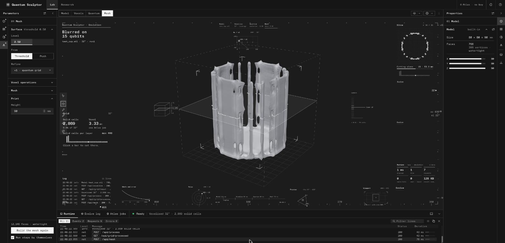

# Quantum Sculpting

**Sculpt 3D models with quantum interference.** Quantum Sculpting turns a 3D model into a voxel grid,
sends the grid through Moth's **Quantum Blur Core** on the **Atlas** platform, and turns the
deformed result back into a printable STL.

**[Try the demo →](https://wedgeglobal.github.io/Quantum-Sculpting/)** · [Guide](docs/guide.md) ·
[Interface](web/README.md)



## How it works

```
Model  →  Voxelise  →  Quantum  →  Mesh  →  Compose
```

1. **Model.** Start from a built-in shape (a test cup, sphere, cube, pyramid, cylinder, cone or
   torus) or import your own `.stl`, `.obj`, `.ply`, `.glb` or `.off`.
2. **Voxelise.** The model becomes a grid from 16³ to 256³ cells, each holding how much of it the
   model fills.
3. **Quantum.** The grid goes through one of four engines:
   - **Atlas** runs the Quantum Blur Core (`blur-core-v1`) on Moth's platform, on real quantum
     hardware or a simulator. Large grids are cut into tiles that fit one job each.
   - **Emulate** runs a local approximation of the Blur Core, which follows real Atlas results
     closely.
   - **Gauss** is a fast local stand-in.
   - **Evolve** treats regions of the model as nations, one qubit each, competing turn by turn. Its
     random numbers can come from quantum chips through Atlas (`comet-qrng-v1`).
4. **Mesh.** A surface is cut from the result at the level you choose, checked for printing, and
   exported as STL.
5. **Compose.** Marks, readouts and quantum glyphs are laid out around the object, and the whole
   view is exported as an image, a video or a 3D file.

The [guide](docs/guide.md) covers each step in detail, including the Atlas API calls.

## Try it

**In the browser:** the [demo](https://wedgeglobal.github.io/Quantum-Sculpting/) plays back real runs
recorded from the app, with no install and no key. Open the test cup to step through a run. Uploading
your own model needs the app on your computer.

**On your computer (macOS, Linux):** you need Python 3.10 or newer, Node.js and
[pnpm](https://pnpm.io).

```bash
git clone https://github.com/wedgeglobal/Quantum-Sculpting.git
cd Quantum-Sculpting
./dev.sh
```

Then open <http://127.0.0.1:5109>. The first run installs everything, which takes a few minutes.

**On Windows:** double-click `run.bat`, then `build-web.bat` for the new interface. See
[Start on Windows](docs/guide.md#start-on-windows).

**Atlas:** to run on Atlas you need a Moth Atlas API key. Paste it with the key button in the top
bar. The key is kept in your user folder, never in the project. Without a key, every engine except
Atlas still works.

## Repository

```
app/      the Python service: voxelising, the quantum engines, Atlas client, meshing
web/      the Quantum Sculptor interface (React, TypeScript, three.js)
tests/    unit and API tests, with a fake Atlas server
docs/     the guide, research notes and the design handoff
```

Tests: `.venv/bin/python -m unittest discover -s tests`.

## Team

Made by [Wedge](https://wedge.global): Peiyan Zou and Ray Zhang. Quantum computing by
Moth on Atlas.

Want to contribute? See [CONTRIBUTING.md](CONTRIBUTING.md).

## License

No license yet: all rights reserved by the authors. Please ask before using the code.

The interface is set in TWK Everett and TWK Everett Mono, which are commercially licensed and not
included. Without the font files it falls back to system fonts.
