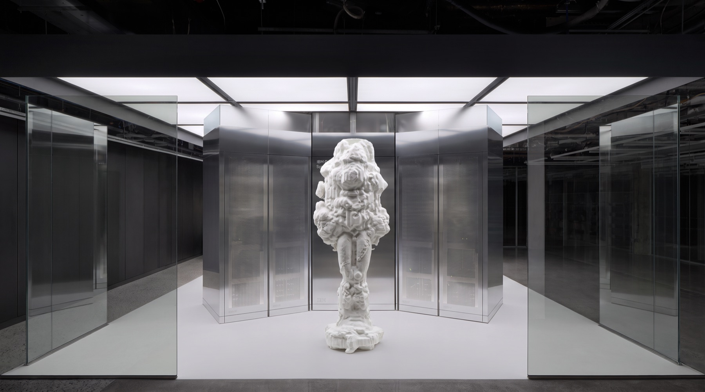
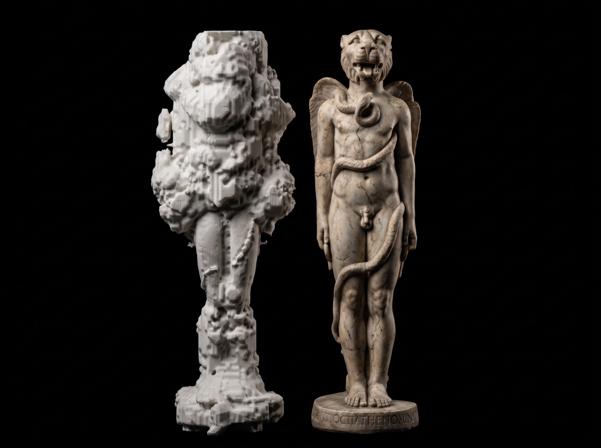

# Quantum Sculptor



**What does a sculpture become when nobody makes its cuts?** Quantum Sculptor hands those decisions to
quantum processes. A 3D model is turned into a grid of voxels, the grid passes through a quantum
circuit, and a printable form is cut from what comes out.

**[Open the app →](https://wedgeglobal.github.io/Quantum-Sculptor/)** It runs entirely in your
browser. Nothing to install.

## The idea

A sculptor's cuts are choices. Here they come from measurement instead. Each run is one outcome
drawn from a field of possible forms, so every print is a counterfactual history of the model it
started from.



## How it works

| Step | What happens |
| --- | --- |
| **Model** | A sphere, cube, pyramid, one of four Calabi-Yau cross-sections, or your own `.stl` `.obj` `.ply` `.glb` `.off`. |
| **Voxelise** | The model becomes a grid of 16³ to 256³ cells. |
| **Quantum** | **Atlas** runs Moth's Quantum Blur Core on quantum hardware. **Emulate** and **Gauss** approximate it locally. **Evolve** splits the model into regions, one qubit each, that grow, fortify and attack turn by turn. |
| **Mesh** | A printable surface is cut from the result and exported as STL. |

## Atlas

Atlas needs a Moth API key. [Get one from Moth](https://platform.mothquantum.com/signin), then paste
it into the app. The key stays in your browser tab. Every other engine works without one.

Engines used: `blur-core-v1` (the blur), `comet-qrng-v1` (Evolve's random numbers, measured on IBM
quantum processors) and `entanglement-shader-v1` (shading).

## Code

```
app/     the service: voxels, quantum engines, Atlas client, meshes (Python)
web/     the interface (React, three.js); on the website it runs app/ in the browser with Pyodide
relay/   a small relay that lets the browser reach Atlas
docs/    guide, research notes, design
```

To work on it locally, see the [guide](docs/guide.md). To contribute, see
[CONTRIBUTING.md](CONTRIBUTING.md).

## Credits

Made by [Wedge](https://wedge.global): Peiyan Zou and Ray Zhang. Quantum computing by Moth.

No license yet. All rights reserved.
